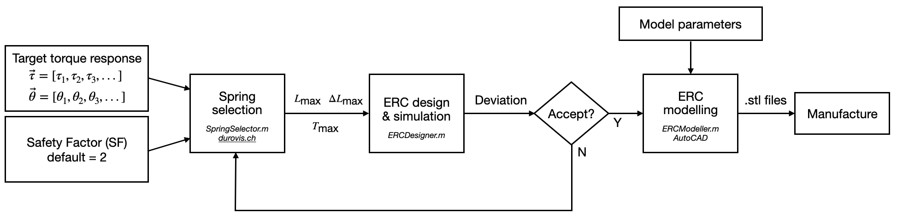
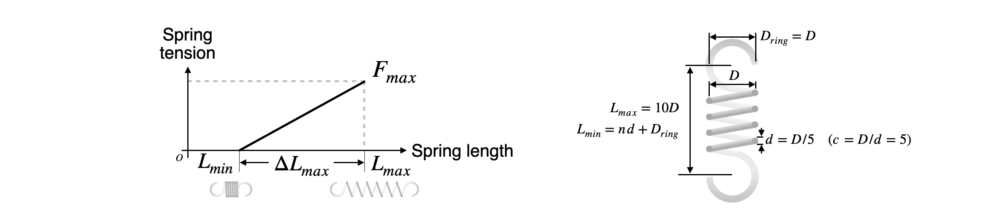

# Elastic Rolling Cam (ERC): Design Guide
**Authors:** Rui Wu, Stefano Mintchev  
*Environmental Robotics Laboratory, ETH Zurich*  
*Email: rui.wu@usys.ethz.ch, stefano.mintchev@usys.ethz.ch*

---

## The ERC Joint
The Elastic Rolling Cam (ERC) is a rotational joint that can replicate an arbitrary rotational stiffness. It comprises a pair of spring-loaded cams. Each cam has an array of spherical teeth that engage with the other cam to prevent slippage between the two cams. When the cams roll against each other, the joint bends, while the variation in spring length and thus the spring-stored elastic energy generates rotational stiffness/torque. The torque response—rotation angle vs. torque—can be "programmed" by designing the cam geometry using our MATLAB program.


---

## Design

### Design Principle
The design input is the torque response that you want the ERC to replicate, parameterized using two vectors: rotation angle vector and torque vector. The only design decision needed is selecting the spring parameters. By choosing appropriate springs, the MATLAB program can generate the ERC geometry to replicate any torque response.


A linear-elastic spring has three independent parameters. Here we use $T_{\text{max}}$, $L_{\text{max}}$, and $\Delta L_{\text{max}}$, which are the spring's maximum tension (N), maximum length (mm), and maximum elongation (mm), as shown below.


According to our study, the spring needs to satisfy two constraints determined from the target response:

```math
\frac{F_{\text{max}} \cdot L_{\text{max}}}{4} \ge \text{SF} \cdot \left|\left(\frac{d\tau}{d\theta}\right)_{\text{min}}\right| \tag{1}
```
```math
\frac{F_{\text{max}} \cdot \Delta L_{\text{max}}}{2} \ge \text{SF} \cdot \Delta U \tag{2}
```
where $`\left|\left(\frac{d\tau}{d\theta}\right)_{\text{min}}\right|`$ is the maximum torque reduction rate of the desired response (N·m/rad), and $\Delta U$ is the maximum elastic energy variation required by the desired response (J). When multiple springs are used in an ERC, $T_{\text{max}}$ relates to their combined effect. The Safety Factor (SF) has a default value of SF = 2.

Choosing a large Safety Factor reduces torque deviation from the desired response, as shown below (left), where negligible Root Mean Square deviation is achieved at SF = 2. However, a large SF results in an oversized ERC due to proportionality with spring length $L_{\text{max}}$. To balance size and performance, SF = 2 is the default, as supported by simulations with 100,000 randomly-generated target stiffness responses.


Determining the three spring parameters $T_{\text{max}}$, $L_{\text{max}}$, and $\Delta L_{\text{max}}$ with two constraint equations gives the user freedom to decide one parameter, such as using a shorter spring for a smaller ERC, which requires a higher $T_{\text{max}}$.

---

### Design Workflow

With the target response (rotation angle vs. torque curve) defined, follow these steps to determine the spring parameters and generate the cam geometry.

1. Input the target response and SF = 2 into `SpringSelector.m` to determine spring parameters $T_{\text{max}}$, $L_{\text{max}}$, and $\Delta L_{\text{max}}$.
2. Select off-the-shelf tension springs (e.g., from [durovis.ch](https://www.durovis.ch)) that meet the requirements. Calculate $\Delta L_{\text{max}}$ using $\Delta L_{\text{max}} = T_{\text{max}} / k$, where $k$ is the spring constant.
3. Input the spring parameters into `ERCdesigner.m` to generate the cam profile and simulate its torque response. Adjust SF if necessary.
4. Use `ERCmodeller.m` and AutoCAD to generate a 3D printable model. See the modelling workflow below.



## Modelling Workflow


1. Set modelling parameters in `ERCmodeller.m`, then run the script to generate CAD files (`convex.scr` and `concave.scr`).
2. Open AutoCAD, run the generated `.scr` file to automatically build the model.
3. Complete the model by creating a loft body between the "hub" and "head" profiles using "LOFT."
4. Use "SOLID, UNION" to merge bodies and "SOLID, SUBTRACT" to create mounting and pivot holes.

---

## Manufacturing

For accuracy, we recommend using a resin 3D printer (Masked Stereolithography/MSLA), such as the Formlabs Form series or Anycubic Photon Mono series, with a resolution of about 10 microns. A high-toughness resin is preferred for impact tolerance. The setup below uses Anycubic Photon Workshop to hollow the part for weight reduction. Ensure that liquid resin is drained, and lattice infill can add structural stability.


An ERC contains three components: cams, springs, and pins for spring mounting. Bearings can reduce friction-induced hysteresis in torque response by allowing free pin rotation.

---

## Case Study

### Target Response
To design an ERC with the following response (high torque at ±90° for end-stopping):


### Spring Requirement
Input this response and SF = 2 into `SpringSelector.m`, which outputs the required parameters. Assume two springs are used, each requiring $L_{\text{max}} \cdot T_{\text{max}} \ge 0.54 \, \text{N} \cdot \text{m}$ and $\Delta L_{\text{max}} \cdot T_{\text{max}} \ge 0.112 \, \text{N} \cdot \text{m}$.

### Spring Selection
Select a spring from [durovis.ch](https://www.durovis.ch) that meets these specifications (e.g., Type 5/1/1 with $T_{\text{max}} = 18.82 \, \text{N}$, $L_{\text{max}} = 30.27 \, \text{mm}$, $\Delta L_{\text{max}} = 15.87 \, \text{mm}$).

### ERC Design
Input the parameters into `ERCmodeller.m`, generate the cam profile, and verify that the response matches the target.


### ERC Modelling
Follow the modelling workflow to obtain the model.


### Manufacture
3D print the model with a 2 mm wall thickness. M3 bolts are used to mount the springs. The assembly weighs 27 g.

---

# Mass Model

In this section, we provide a computationally lightweight method to estimate the mass of an ERC based on the target response. The mass model (Eq. 13) considers the mass of the spring and cams. The cams' mass is determined by their size, which depends on the spring design. According to JIS B2704 (2000), the spring tension $F$ and spring constant $k$ (N/mm) can be calculated from the spring's geometry:

```math
F = \frac{\pi \sigma D^2}{8c\chi} \tag{3}
```

```math
k = \frac{GD}{8nc^3} \tag{4}
```

where the spring geometrical parameters $D$ and $c$ are defined in the figure below, $\sigma$ is the shear stress, $G$ is the shear modulus, and $\chi = (4c - 1)/(4c - 4)$ is a stress correction factor.



Assuming the spring material is the most common A228 steel (piano wire/spring steel), the shear yielding stress is approximately $\sigma_{max} = 1,200 \, \text{N/mm}^2$, and $G = 80,000 \, \text{N/mm}^2$. Substituting $\sigma_{max}$ into Eq. 3, the maximum allowable tension $F_{max}$ in N is:

```math
F_{max} = \frac{\pi \sigma_{max} D^2}{8c\chi} \tag{5}
```

From this and Eq. 4, we can evaluate the maximum allowable spring extension $\Delta L_{max}$ in mm:

```math
\Delta L_{max} = \frac{F_{max}}{k} = \frac{n \pi \epsilon c D}{\chi} \tag{6}
```

where $\epsilon = \sigma_{max}/G$ is the shear strain at yield, and $n$ is the number of spring coils. Assuming the spring reaches zero tension at $L_{min}$ when the spring wires are fully packed, we have $L_{min} = nd + D_{ring}$. The spring's maximum length $L_{max}$ in mm is:

```math
L_{max} = L_{min} + \Delta L = \frac{nD}{c} \left(\frac{\pi \epsilon c^2}{\chi} + 1\right) + D_{ring} \tag{7}
```

Substituting Eq. 5 and 7 into Eq. 1, we obtain:

```math
D \geq \left(\frac{32 \, \text{SF} \left|\left(\frac{d\tau}{d\theta}\right)_{min}\right| c^3 \chi}{\pi \sigma_{max} \left(\frac{n}{c} \left(\frac{\pi \epsilon c^2}{\chi} + 1\right) + 1\right)}\right)^{1/3} \tag{8}
```

where we assume $D_{ring} = D$. Substituting Eq. 5 and 6 into Eq. 2 gives:

```math
D \geq \left(\frac{16 \, \text{SF} \Delta U c^2 \chi^2}{n \pi^2 \epsilon \sigma_{max}}\right)^{1/3} \tag{9}
```

From the spring diameter $D$, the spring mass can be evaluated as:

```math
\text{mass}_{\text{spring}} = \frac{n \pi^2 \rho D^3}{4c^2} \tag{10}
```

where $\rho = 0.0078 \, \text{g/mm}^3$ is the spring material's density.

The mass of each cam is estimated by the mass of a cube with side length $L_{max}$, material density of $0.001 \, \text{g/mm}^3$ (3D printing resin), and porosity of 50% (accounting for the mounting holes and part hollowing). The ERC mass is thereby estimated as follows:

```math
\text{mass}_{\text{ERC}} = \left(\frac{n \pi^2 \rho D^3}{4c^2} + 2 \cdot 10^{-4} L_{max}^3\right) \tag{11}
```

To simplify the mass model with a unique output from any input of $\left|\left(\frac{d\tau}{d\theta}\right)_ {min}\right|$ and $\Delta U$, the number of independent spring geometrical parameters is reduced to one by setting $c = 5$, $L_{max} = 10D$, and $D_{ring} = D$. Then, the number of spring coils, which is constant as long as $L_{max} = 10D$, is calculated as:

```math
n = \frac{c(L_{max} - D_{ring})}{D \left(\frac{\pi \epsilon c^2}{\chi} + 1\right)} \approx 24 \tag{12}
```

By setting $\text{SF} = 2$ and substituting the spring geometrical parameters into Eq. 8, 9, and 11, the mass of the ERC (in g) can be estimated as follows to realize a target response with maximum torque reduction rate $\left|\left(\frac{d\tau}{d\theta}\right)_{min}\right|$ in $\text{N} \cdot \text{mm}/\text{rad}$ and energy variation $\Delta U$ in mJ:

```math
\text{mass}_{\text{ERC}} = \max\left(0.14 \left|\left(\frac{d\tau}{d\theta}\right)_{min}\right|, \; 0.17 \Delta U, \; 25\right) \tag{13}
```

Here, $\text{mass}_{\text{ERC}}$ is expressed as the maximum of three values. The first two represent ERCs sized for the two independent requirements defined by Eq. 1 and 2, and the third sets a minimum ERC mass of 25 g, which is necessary to guarantee sufficient structural integrity and out-of-plane stiffness. In the estimated ERC mass, the spring contributes approximately 5%. This mass model (Eq. 13) can be implemented in a simulation program to estimate the mass of any ERC joints (in g) from the target response. 

When angular sensor is used (detailed in the next section), 10 g should be added to $\text{mass}_{\text{ERC}}$ to account for the mass of bearings (5 g), sensor (2 g), coupler, and bolts.

When an ERC uses multiple springs, the spring length can be reduced, and thus the cams' mass. In this case, the mass is evaluated based on $\left|\left(\frac{d\tau}{d\theta}\right)_ {min}\right|$ and $\Delta U$ divided by the number of springs, which is implemented in the design program.

---

## Sensor Integration

This section describes how to integrate an angular sensor into an ERC to measure its bending angle. Thanks to the symmetry of the two cams, the rotation of the spring with respect to either of the cams always equals half of the ERC's bending angle. An angular sensor is therefore integrated into the cam to measure the rotation of the spring's pivot. This can be mechanically implemented in various ways, as long as it allows the sensor to accurately follow the spring's rotation without inducing excessive mechanical resistance to bending. One example is shown in the figure below. To create the 3D printable model, the last section of code `Step3_ERCmodeller` should call `ERCscr_sensorised_convex_potentiometer` and `ERCscr_sensorised_concave`, which generate the `.src` scripts for Cam 1 (with potentiometer and convex tooth) and Cam 2 (with concave tooth), respectively. The model parameters are illustrated by the red text in the figure below. The 3D and 2D sketch of the coupler is provided in this repository. 

Note that in the model below, two M2 bolts in Cam 1 provide an extra end-stopping effect, which is necessary for a robust prototype. The locker bolt and nut locks the coupler to the potentiometer shaft. The shaft should be close to the neutral position at zero ERC bending angle, to prevent over-rotating it. The shaft diameter need to be shaved/sanded down by 0.1-0.2 mm to fit in the bearing hole. It is recommended to assemble Cam1 and coupler first, then move on to Cam2.


The angular sensor used is the Alps Alpine RK09K1130A70 potentiometer, is designed to have a linear rotation-resistance mapping, but with several percent of nonlinearity. This can be calibrated using the function below, which is determined by measuring five potentiometers:

```math
       Pivot\_rotation = 0.2097(Pin3-512) + 2.243E-6(Pin3-512)^2 + 1.095E-7(Pin3-512)^3
```

where $Pin3$ is the reading from Arduino Nano analogue pin A3, which has a range of 0-1023. Note that this function works with the pinout illustrated in the figure above. The GND and 5V should not be swapped.

The Arduino code `ERC_sensorised.ino` included in this repository outputs the ERC bending angle through the serial port, which can be visualized in real time using the Matlab code `ERC_demo.m`.

Note that the length of the coupler (5 mm if you are using the coupler provided in this repository) is included in $L_{\text{max}}$, i.e., the length of the actual spring used in a sensorised ERC should be 5 mm shorter than $L_{\text{max}}$, while $\Delta L_{\text{max}}$ is unaffected. In $\text{mass}_{\text{ERC}}$. Also, 10 g should be added to account for the mass of bearings (5 g), sensor (2 g), coupler, and bolts, which can be done by setting `sensorised = 1` in `Step1_SpringSelector.m`. 

---

## Acknowledgment
This work is funded by the European Union’s Horizon Europe research and innovation programme under the project SPEAR (Grant No. 101119774), the Swiss National Science Foundation (SNSF) under the Eccellenza Grant (Grant No. 186865), and the ETH Zurich Research Grants (Grant No. ETH-15 20-2).
